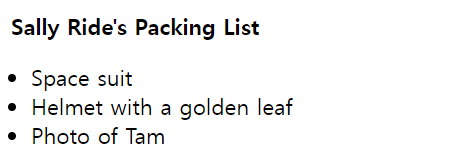
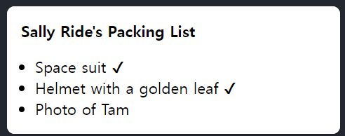
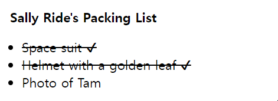
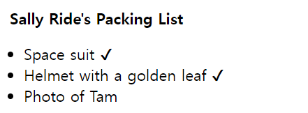
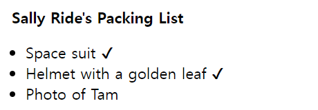
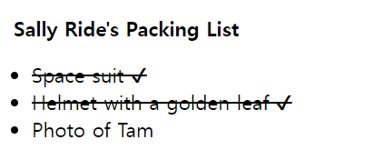

# 조건부 렌더링

컴포넌트는 서로 다른 조건에 따라 다른 것을 보여줘야 하는 경우가 자주 발생합니다.  
React에서는 if 문, &&, ? : 연산자 같은 JavaScript 문법을 사용해 조건부로 JSX를 렌더링할 수 있습니다.

## 학습 내용

- 조건에 따라 다른 JSX를 반환하는 방법
- 일부 JSX를 조건부로 포함하거나 제외하는 방법
- React 코드베이스에서 흔히 접할 수 있는 조건부 구문 단축 표현

## 조건부로 반환하는 JSX

상품이 포장되었는지 여부를 표시할 수 있는 여러 개의 Item을 렌더링하는 PackingList 컴포넌트가 있다고 가정해봅시다:

```jsx
function Item({ name, isPacked }) {
  return <li className="item">{name}</li>;
}

export default function PackingList() {
  return (
    <section>
      <h1>Sally Ride's Packing List</h1>
      <ul>
        <Item isPacked={true} name="Space suit" />
        <Item isPacked={true} name="Helmet with a golden leaf" />
        <Item isPacked={false} name="Photo of Tam" />
      </ul>
    </section>
  );
}
```



일부 Item 컴포넌트의 isPacked prop이 false가 아닌 true로 설정되어 있는 것을 확인할 수 있습니다. isPacked={true}인 경우, 패킹된 아이템에 체크 표시(✔)를 추가하고 싶을 것입니다.

이를 다음과 같이 if/else 문으로 작성할 수 있습니다:

```jsx
if (isPacked) {
  return <li className="item">{name} ✔</li>;
}
return <li className="item">{name}</li>;
```

| isPacked prop이 true이면 이 코드는 다른 JSX 트리를 반환합니다.
| 이렇게 변경하면 일부 항목의 마지막에 체크 표시가 나타납니다:

```jsx
function Item({ name, isPacked }) {
  if (isPacked) {
    return <li className="item">{name} ✔</li>;
  }
  return <li className="item">{name}</li>;
}

export default function PackingList() {
  return (
    <section>
      <h1>Sally Ride's Packing List</h1>
      <ul>
        <Item isPacked={true} name="Space suit" />
        <Item isPacked={true} name="Helmet with a golden leaf" />
        <Item isPacked={false} name="Photo of Tam" />
      </ul>
    </section>
  );
}
```



두 경우 모두 반환되는 내용을 편집해보고 결과가 어떻게 달라지는지 확인해 보세요!

JavaScript의 if와 return 문으로 분기 로직을 어떻게 생성하는지 주목하세요. React에서 조건과 같은 제어 흐름은 JavaScript로 처리됩니다.

## null을 사용해 조건부로 아무것도 반환하지 않기

어떤 상황에서는 아무것도 렌더링하고 싶지 않을 수도 있습니다.  
예를 들어, 포장된 아이템을 전혀 표시하고 싶지 않다고 가정해 보겠습니다.  
컴포넌트는 무언가를 반환해야 합니다. 이 경우 null을 반환하면 됩니다:

```jsx
if (isPacked) {
  return null;
}
return <li className="item">{name}</li>;
```

isPacked가 참이면 컴포넌트는 아무것도 반환하지 않고 null을 반환합니다. 그렇지 않으면 렌더링할 JSX를 반환합니다.

```jsx
function Item({ name, isPacked }) {
  if (isPacked) {
    return null;
  }
  return <li className="item">{name}</li>;
}

export default function PackingList() {
  return (
    <section>
      <h1>Sally Ride's Packing List</h1>
      <ul>
        <Item isPacked={true} name="Space suit" />
        <Item isPacked={true} name="Helmet with a golden leaf" />
        <Item isPacked={false} name="Photo of Tam" />
      </ul>
    </section>
  );
}
```


실제로 컴포넌트에서 null을 반환하는 것은 렌더링하려는 개발자를 놀라게 할 수 있기 때문에 일반적이지 않습니다.  
부모 컴포넌트의 JSX에 컴포넌트를 조건부로 포함하거나 제외하는 경우가 더 많습니다.  
이를 수행하는 방법은 다음과 같습니다!

## 조건을 포함한 JSX

이전 예제에서는 컴포넌트가 반환할 JSX 트리(있는 경우!)를 제어했습니다.  
렌더링 출력에서 이미 일부 중복을 발견했을 수 있습니다:

```jsx
<li className="item">{name} ✔</li>
```

이는 아래와 매우 유사합니다.

```jsx
<li className="item">{name}</li>
```

두 조건부 브랜치 모두 `<li className="item">...</li>`를 반환합니다:

```jsx
if (isPacked) {
  return <li className="item">{name} ✔</li>;
}
return <li className="item">{name}</li>;
```

이러한 중복은 해롭지는 않지만 코드를 유지 관리하기 어렵게 만들 수 있습니다.  
`className`을 변경하려면 어떻게 해야 할까요?  
코드의 두 곳에서 변경해야 할 것입니다!  
이런 상황에서는 조건부로 약간의 JSX를 포함시켜 코드를 더 DRY하게(덜 반복적이게) 만들 수 있습니다.

## 조건(삼항) 연산자(? :)

JavaScript에는 조건 연산자 또는 “삼항 연산자”라는 조건식 작성을 위한 간결한 구문이 있습니다.

아래 대신에:

```jsx
if (isPacked) {
  return <li className="item">{name} ✔</li>;
}
return <li className="item">{name}</li>;
```

이렇게 쓸 수 있습니다:

```jsx
return <li className="item">{isPacked ? name + " ✔" : name}</li>;
```

“isPacked가 참이면 (?) name + ' ✔'를 렌더링하고,  
그렇지 않으면 (:) name을 렌더링하라” 라고 읽을 수 있습니다.

### DEEP DIVE | 심층 탐구

### 이 두 예제는 완전히 동일할까요?

객체 지향 프로그래밍에 익숙하다면,  
위의 두 예제 중 하나가 `<li>`의 서로 다른 두 “인스턴스”를 생성할 수 있기 때문에 미묘하게 다르다고 생각할 수 있습니다.  
하지만 JSX 요소는 내부 state를 보유하지 않고 실제 DOM 노드가 아니기 때문에 “인스턴스”가 아닙니다.  
이는 청사진과 같은 가벼운 설명입니다.  
이 두 예제는 사실 완전히 동등합니다.  
state 보존 및 재설정에서 작동 방식에 대해 자세히 설명합니다.

<br>

이제 완성된 항목의 텍스트를 `<del>`과 같은 다른 HTML 태그로 감싸서  
줄을 긋고 싶다고 가정해 봅시다.  
더 많은 개행과 괄호를 추가하여 각 대소문자를 더 쉽게 중첩할 수 있습니다:

```jsx
function Item({ name, isPacked }) {
  return <li className="item">{isPacked ? <del>{name + " ✔"}</del> : name}</li>;
}

export default function PackingList() {
  return (
    <section>
      <h1>Sally Ride's Packing List</h1>
      <ul>
        <Item isPacked={true} name="Space suit" />
        <Item isPacked={true} name="Helmet with a golden leaf" />
        <Item isPacked={false} name="Photo of Tam" />
      </ul>
    </section>
  );
}
```



이 스타일은 간단한 조건에 적합하지만 적당히 사용하세요.
중첩된 조건 마크업이 너무 많아 컴포넌트가 지저분해지면 자식 컴포넌트를 추출하여 정리하는 것을 고려하세요. React에서 마크업은 코드의 일부이므로 변수나 함수와 같은 도구를 사용해 복잡한 표현식을 정리할 수 있습니다.

## 논리 AND 연산자(&&)

또 다른 일반적인 단축표현으로 JavaScript AND(&&) 논리 연산자가 있습니다. React 컴포넌트 내에서 조건이 참일 때 일부 JSX를 렌더링하거나 그렇지 않으면 아무것도 렌더링하지 않으려 할 때 자주 사용됩니다. &&를 사용하면 isPacked가 true일 때만 조건부로 체크 표시를 렌더링할 수 있습니다:

```jsx
return (
  <li className="item">
    {name} {isPacked && "✔"}
  </li>
);
```

이는 “만약 isPacked이면 (&&) 체크 표시를 렌더링하고,  
그렇지 않으면 아무것도 렌더링하지 않습니다” 로 읽을 수 있습니다.

아래는 실제로 작동하는 모습입니다:

```jsx
function Item({ name, isPacked }) {
  return (
    <li className="item">
      {name} {isPacked && "✔"}
    </li>
  );
}

export default function PackingList() {
  return (
    <section>
      <h1>Sally Ride's Packing List</h1>
      <ul>
        <Item isPacked={true} name="Space suit" />
        <Item isPacked={true} name="Helmet with a golden leaf" />
        <Item isPacked={false} name="Photo of Tam" />
      </ul>
    </section>
  );
}
```



JavaScript && 표현식은 왼쪽(조건)이 true이면 오른쪽(이 경우 체크 표시)의 값을 반환합니다. 하지만 조건이 false이면 표현식 전체가 false가 됩니다. React는 false를 null이나 undefined와 마찬가지로 JSX 트리상의 “구멍”으로 간주하고, 그 자리에 아무것도 렌더링하지 않습니다.

### Pitfall | 함정

### &&의 왼쪽에 숫자를 넣지 마세요.

조건을 테스트하기 위해, JavaScript는 왼쪽을 자동으로 불리언으로 변환합니다. 그러나 왼쪽이 0이면 전체 표현식이 해당 값(0)을 가져오고, React는 기꺼이 빈 값 대신 0을 렌더링합니다.

예를 들어, 흔히 하는 실수 중 하나는 `messageCount` && `<p>New messages</p>`와 같은 코드를 작성하는 것입니다. messageCount가 0일 때 아무것도 렌더링하지 않는다고 생각하기 쉽지만, 실제로는 0 자체를 렌더링합니다!

이 문제를 해결하려면 왼쪽을 불리언으로 만들면 됩니다: `messageCount > 0 && <p>New messages</p>`

## 변수에 조건부로 JSX 할당하기

단축키가 일반 코드를 작성하는 데 방해가 된다면 if 문과 변수를 사용해 보세요. let으로 정의된 변수는 재할당할 수 있으므로, 표시할 기본 콘텐츠인 이름을 지정하는 것부터 시작하세요:

`let itemContent = name;`

if 문을 사용하여 isPacked가 true면 JSX 표현식을 itemContent에 재할당합니다:

```jsx
if (isPacked) {
  itemContent = name + " ✔";
}
```

중괄호는 “JavaScript로의 창”을 엽니다.  
중괄호로 변수를 반환된 JSX 트리에 삽입하여 이전에 계산된 표현식을 JSX 안에 중첩시킵니다:

```jsx
<li className="item">{itemContent}</li>
```

이 스타일은 가장 장황하지만 가장 유연하기도 합니다. 실제로 사용해보겠습니다:

```jsx
function Item({ name, isPacked }) {
  let itemContent = name;
  if (isPacked) {
    itemContent = name + " ✔";
  }
  return <li className="item">{itemContent}</li>;
}

export default function PackingList() {
  return (
    <section>
      <h1>Sally Ride's Packing List</h1>
      <ul>
        <Item isPacked={true} name="Space suit" />
        <Item isPacked={true} name="Helmet with a golden leaf" />
        <Item isPacked={false} name="Photo of Tam" />
      </ul>
    </section>
  );
}
```



이전과 마찬가지로 텍스트뿐만 아니라 임의의 JSX에서도 작동합니다:

```jsx
function Item({ name, isPacked }) {
  let itemContent = name;
  if (isPacked) {
    itemContent = <del>{name + " ✔"}</del>;
  }
  return <li className="item">{itemContent}</li>;
}

export default function PackingList() {
  return (
    <section>
      <h1>Sally Ride's Packing List</h1>
      <ul>
        <Item isPacked={true} name="Space suit" />
        <Item isPacked={true} name="Helmet with a golden leaf" />
        <Item isPacked={false} name="Photo of Tam" />
      </ul>
    </section>
  );
}
```



JavaScript에 익숙하지 않다면 처음에는 이 다양한 스타일이 압도적으로 보일 수 있습니다.  
하지만 이 스타일들을 익히면 React 컴포넌트뿐 아니라 모든 JavaScript 코드를 읽고 작성하는 데 도움이 됩니다!  
우선 선호하는 스타일을 선택한 다음,  
다른 스타일이 어떻게 작동하는지 잊어버렸다면 이 레퍼런스를 다시 참조하세요.

## 요약

- React에서는 JavaScript로 분기 로직을 제어합니다.
- if문으로 조건부로 JSX 표현식을 반환할 수 있습니다.
- 중괄호를 사용하여 일부 JSX를 변수에 조건부로 저장한 다음 다른 JSX 안에 포함할 수 있습니다.
- JSX에서 `{cond ? <A /> : <B />}`는 “cond가 있으면 `<A />`를 렌더링하고, 그렇지 않으면 `<B />`를 렌더링하라” 를 의미합니다.
- JSX에서 `{cond && <A />}`는 “cond가 있으면 `<A />`를 렌더링하고, 그렇지 않으면 아무것도 렌더링하지 말라” 를 의미합니다.
- 이 단축용법은 흔히 쓰이지만, 만약 if를 선호한다면 굳이 사용하지 않아도 됩니다.
