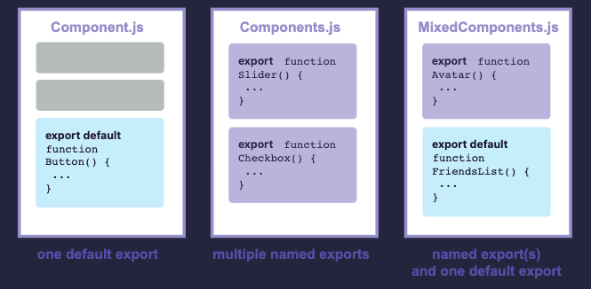

## 🚀 컴포넌트 가져오기와 내보내기

컴포넌트들의 매직은 그들의 재사용성에 놓여있다 : 당신은 컴포넌트들을 만들 수 있고,  
그 컴포넌트들은 다른 컴포넌트들로 구성되어져 있다.  
하지만 더 많은 컴포넌트들을 더 많이 중첩할수록, 다른 파일들 안에 그것들을 분리시키는게 종종 합리적이다.  
다른 파일들 안에 분리시키는 것은 더 많은 위치에서 컴포넌트들을 재사용하게 하고 파일들을 쉽게 스캔하게 만들어준다.

### 배울것들

- 루트 컴포넌트 파일이 무엇인지
- 어떻게 컴포넌트를 가져오고 내보내는지
- default를 사용하는 시기 와 명명된 imports 와 exports를 사용하는 시기
- 하나의 파일로부터 다수의 컴포넌트들을 import하고 export 하는 방법
- 컴포넌트들을 다수의 파일로 분리시키는 방법

## 🤞 루트 컴포넌트 파일

첫번째 컴포넌트에서 Profile 컴포넌트와 그것을 렌더링 하는 Gallery 컴포넌트를 만들었다.

```jsx
function Profile() {
  return (
    
  );
}

export default function Gallery() {
  return (
    <section>
      <h1>Amazing scientists</h1>
      <Profile />
      <Profile />
      <Profile />
    </section>
  );
}

```


이 요소들은 현재 App.js 라는 루트 컴포넌트 파일안에 존재한다.

하지만 설정에 따라서 루트 컴포넌트는 다른 파일에 있을 수 도 있다.

만약에 Next.js 같은 파일기반 라우팅을 가지고 있는 프레임워크를 사용한다면,

루트 컴포넌트는 모든 페이지에서 달라질 것이다.

<br>

## 📝 컴포넌트 내보내기와 가져오기

앞으로 랜딩 화면을 바꿔서 거기에 과학도서 목록을 넣고 싶다면?

아니면 모든 프로필을 다른 곳에 배치하겠다면?

루트 컴포넌트 파일에서 Gallery 와 Profile 을 이동시키는 것이 합리적이다.

이렇게 하는 것이 더 모듈화되고 재사용이 가능해지게 한다. 

다음 세단계로 컴포너트를 이동시킬 수 있다.

1. 컴포넌트 안에 새로운 JS파일을 만들어라.
2. 너의 함수 컴포넌트를 내보내라 그 파일로부터, (default 나 명명된 exports 를 사용해서)
3. 너가 사용할 함수 컴포넌트들을 파일에 import 해라.( default 나 명명된 exports를 importing에  해당 기술을 사용하면서)

여기에서는 Profile과 Gallery 가 모두 App.js에서 Gallery.js라는 새 파일로 이동되었습니다.

이제 Gallery.js 에서 Gallery 컴포넌트를 가져와서 App.js를 바꿀 수 있다.

```jsx
// App.js

import Gallery from './Gallery.js';

export default function App() {
  return (
    <Gallery />
  );
}
```

```jsx
// Gallery.js

function Profile() {
  return (
    
  );
}

export default function Gallery() {
  return (
    <section>
      <h1>Amazing scientists</h1>
      <Profile />
      <Profile />
      <Profile />
    </section>
  );
}
```


이 예제가 두개의 컴포넌트 파일들로 어떻게 구분되는지 확인해라.

1. Gallery.js :
- export 되지 않고 오직 같은 파일 안에서만 사용되는 Profile 컴포넌트를 정의해라
- default export 로써 Gallery 컴포넌트를 내보내라.

1. App.js
- Gallery.js 로부터 default import 로써 Gallery를 내보내라
- 루트 App 컴포넌트를 default export로 내보내라.

## 📔 Note

다음과 같이 .js 파일 확장자가 없는 파일들을 마주칠 수도 있다.

```jsx
import Gallery from './Gallery';
```

' ./Gallery.js '  또는  ' ./Gallery '는 React에서 작동하지만 전자가 기본 ES 모듈 작동 방식에 더 가깝습니다.

### 📌 Deep Dive

**Default  vs  named exports**  🤔

Javascript 를 사용해서 값을 내보내는 주요한 두가지 방법이 있다.

default exports 와 named exports 이다.

지금까지 예시들은 default exports 만 사용했다.

하지만 같은 파일에서 그것들 중 하나 혹은 둘 다 사용할 수 있다.

파일에는 default export가 하나만 있을 수 있지만, named exports는 원하는 만큼 많이 가질 수 있다.



컴포넌트를 export하는 방법에 따라서 import 하는 방법이 결정된다.

named export 와 동일한 방식으로 default export를 import 하려고 하면 에러가 날 것이다.

이 차트는 다음을 추적하는 데 도움이 된다.

| Syntax | Export statement | Import statement |
| --- | --- | --- |
| Default | export default function Button() {} | import Button from './Button.js'; |
| Named | export function Button() {} | import { Button } from './Button.js'; |  
  

<br>
default 를 import 할 때, import 후에 원하는 이름으로 입력이 가능하다.

예를 들어, 대신 import Banana from './Button.js'라고 쓸 수 있으며

여전히 동일한 default export가 제공됩니다.

대조적으로, named 를 imports 하게 되면, 이름이 양쪽에서 일치해야한다.

그것이 named imports 라고 불리는 이유이다.

사람들은 파일이 한개의 컴포넌트만 export 할때 default exports 를 자주 사용하고 

다수의 컴포넌트들과 값들을 export 할때에는 named export를 자주 사용한다.

선호하는 코딩 스타일에 상관없이, 컴포넌트 기능들과 이를 포함하는 파일들에 항상 의미있는 이름들을 지정해라.

export defult () ⇒ { } 와 같이 이름이 없는 컴포넌트는 디버깅을 더 어렵게 만들기 때문에 권장되지 않는다.  
<br>

## 🪂 동일한 파일로부터 다수의 컴포넌트들을 가져오고 내보내기

gallery 대신에 하나의 Profile만 표시하려면 어떻게 해야할까?

Profile 컴포넌트도 export 할 수 있다.

하지만 Gallery.js는 이미 default 로 export 하고 있고 두개의 default export를 할 수 는 없다.

default export를 사용해서 새 파일을 생성하거나 Profile에 대해 named export를 추가할 수 있다.

파일은 한개의 default export  만 가질 수 있지만, named exports 는 여러개를 가질 수 있다.
<br>

### 📔 Note

default 와 named exports 사이의 잠재적인 혼란을 줄이기 위해,

일부 팀들은 한개의 스타일만 고수하기로 선택하거나 혹은 single file에 혼합해서 사용하는 것을 피한다.

너에게 가장 최고를 선택해라.

먼저, (default 키워드가 아니라 )  named export를 사용해서 Profile 을 Gallery.js 로부터 export 해라

```jsx
export function Profile() {
  // ...
}
```

그 다음, named export 를 사용해서 Gallery.js 로부터 App.js 로 Profile 을 import 해라. (중괄호를 사용해서)

```jsx
import { Profile } from './Gallery.js';
```

마지막으로, App 컴포넌트에서  `<Profile />`을 렌더링해라.

```jsx
export default function App() {
  return <Profile />;
}
```

이제 Gallery.js는 두개의 exports를 포함한다 : default Gallery export, 그리고 named Profile export.

App.js는 그것들을 모두 import한다.

`<Profile />`을 <Gallery /> 로 편집하고 다시 되돌려봐라.

```jsx
// App.js

import Gallery from './Gallery.js';
import { Profile } from './Gallery.js';

export default function App() {
  return (
    <Profile />
  );
}

// Gallery.js

export function Profile() {
  return (
    
  );
}

export default function Gallery() {
  return (
    <section>
      <h1>Amazing scientists</h1>
      <Profile />
      <Profile />
      <Profile />
    </section>
  );
}
```


이제 default 와 named exports를 혼합해서 사용한다.

- `Gallery.js`:
    - Profile 컴포넌트를 Profile 이라는 named export 내보내기로 내보냅니다.
    - Gallery 컴포넌트를 default export로 export 해라.
- `App.js`:
    - Gallery.js 로 부터 Profile이라고 불리는 named import로써 Profile를 import 해라.
    - Gallery.js에서 기본 가져오기로 갤러리를 가져옵니다.
    - 루트 앱 컴포넌트를 default export 로 내보냅니다.

<br>

## 📚 요약

이번 페이지에서 배운 것은 :

- 루트 컴포넌트 파일이 무엇인지
- 어떻게 컴포넌트를 import 하고 export 하는지
- default 와 named 를 언제 그리고 어떻게  imports 하고 exports 하는지
- 동일한 파일로부터 다수의 컴포넌트를 export 하는 방법