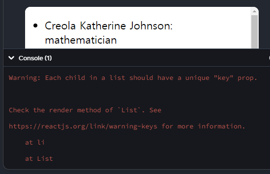
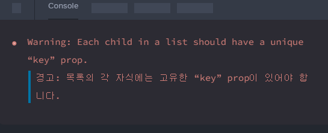
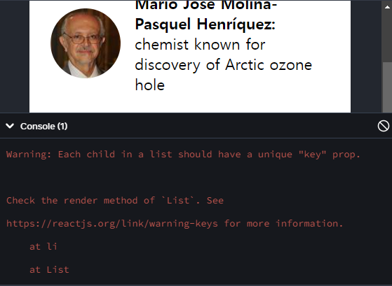
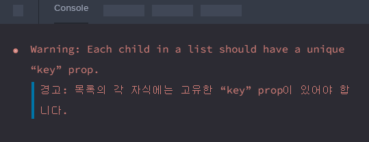

# 목록 렌더링

데이터 모음에서 유사한 컴포넌트를 여러 개 표시하고 싶을 때가 많습니다.  
JavaScript 배열 메서드를 사용해 데이터 배열을 조작할 수 있습니다.  
이 페이지에서는 React에서 `filter()`와 `map()`을 사용해 데이터 배열을 필터링하고 컴포넌트 배열로 변환하겠습니다.

## 학습 내용

- JavaScript의 `map()`을 사용하여 배열에서 컴포넌트를 렌더링하는 방법
- JavaScript의 `filter()`를 사용해 특정 컴포넌트만 렌더링하는 방법
- React에서 key를 사용하는 경우와 그 이유

## 배열에서 데이터 렌더링하기

### 다음과 같은 콘텐츠 목록이 있다고 가정해 보겠습니다.

```HTML
<ul>
  <li>Creola Katherine Johnson: mathematician</li>
  <li>Mario José Molina-Pasquel Henríquez: chemist</li>
  <li>Mohammad Abdus Salam: physicist</li>
  <li>Percy Lavon Julian: chemist</li>
  <li>Subrahmanyan Chandrasekhar: astrophysicist</li>
</ul>
```

이러한 목록 항목의 유일한 차이점은 콘텐츠, 즉,데이터입니다.  
댓글 목록에서 프로필 이미지 갤러리에 이르기까지 인터페이스를 구축할 때 서로 다른 데이터를 사용하여 동일한 컴포넌트의 여러 인스턴스를 표시해야 하는 경우가 종종 있습니다.  
이러한 상황에서는 해당 데이터를 `JavaScript 객체`와 `배열`에 저장하고  
`map()` 및` filter()`와 같은 메서드를 사용하여 컴포넌트 목록을 렌더링할 수 있습니다.

다음은 배열에서 항목 목록을 생성하는 방법에 대한 간단한 예시입니다:
<br>

### 1. 데이터를 배열로 이동합니다:

```jsx
const people = [
  "Creola Katherine Johnson: mathematician",
  "Mario José Molina-Pasquel Henríquez: chemist",
  "Mohammad Abdus Salam: physicist",
  "Percy Lavon Julian: chemist",
  "Subrahmanyan Chandrasekhar: astrophysicist",
];
```

### 2. people 멤버를 새로운 JSX 노드 배열인 listItems에 매핑합니다:

```jsx
const listItems = people.map((person) => <li>{person}</li>);
```

### 3. 컴포넌트에서 `<ul>`로 감싼 listItems를 반환합니다:

```jsx
return <ul>{listItems}</ul>;
```

결과는 다음과 같습니다:

```jsx
const people = [
  "Creola Katherine Johnson: mathematician",
  "Mario José Molina-Pasquel Henríquez: chemist",
  "Mohammad Abdus Salam: physicist",
  "Percy Lavon Julian: chemist",
  "Subrahmanyan Chandrasekhar: astrophysicist",
];

export default function List() {
  const listItems = people.map((person) => <li>{person}</li>);
  return <ul>{listItems}</ul>;
}
```



위의 샌드박스에 콘솔 오류가 표시되는 것을 확인할 수 있습니다:



이 오류를 수정하는 방법은 이 페이지의 뒷부분에서 알아보겠습니다.  
그 전에 데이터에 몇 가지 구조를 추가해 보겠습니다.

## 항목 배열 필터링하기

### 이 데이터는 훨씬 더 구조화할 수 있습니다.

```jsx
const people = [
  {
    id: 0,
    name: "Creola Katherine Johnson",
    profession: "mathematician",
  },
  {
    id: 1,
    name: "Mario José Molina-Pasquel Henríquez",
    profession: "chemist",
  },
  {
    id: 2,
    name: "Mohammad Abdus Salam",
    profession: "physicist",
  },
  {
    id: 3,
    name: "Percy Lavon Julian",
    profession: "chemist",
  },
  {
    id: 4,
    name: "Subrahmanyan Chandrasekhar",
    profession: "astrophysicist",
  },
];
```

profession이 `'chemist'`인 사람만 표시하는 방법을 원한다고 가정해 봅시다.  
JavaScript의 `filter()` 메서드를 사용하여 해당 사람들만 반환할 수 있습니다.  
이 메서드는 항목 배열을 받아 “테스트”(`true` 또는 `false를` 반환하는 함수)를 통과한 후,  
테스트를 통과한 항목만 포함된 새 배열을 반환합니다(`true` 반환).

`profession`이 `'chemist'`인 항목만 원합니다.  
이를 위한 “test” 함수는` (person) => person.profession === 'chemist'`와 같습니다.  
이를 조합하는 방법은 다음과 같습니다:

1. `people`에서 `person.profession === 'chemist'` 조건으로` filter()`를 호출하여,  
   `“chemist”`만 있는 새로운 배열인 `chemists`를 생성합니다:

```jsx
const chemists = people.filter((person) => person.profession === "chemist");
```

2. 이제 `chemists` 위에 매핑합니다:

```jsx
const listItems = chemists.map((person) => (
  <li>
    
    <p>
      <b>{person.name}:</b>
      {" " + person.profession + " "}
      known for {person.accomplishment}
    </p>
  </li>
));
```

3. 마지막으로 컴포넌트에서 `listItems`를 반환합니다:

```jsx
return <ul>{listItems}</ul>;
```

```jsx
import { people } from "./data.js";
import { getImageUrl } from "./utils.js";

export default function List() {
  const chemists = people.filter((person) => person.profession === "chemist");
  const listItems = chemists.map((person) => (
    <li>
      
      <p>
        <b>{person.name}:</b>
        {" " + person.profession + " "}
        known for {person.accomplishment}
      </p>
    </li>
  ));
  return <ul>{listItems}</ul>;
}
```



### Pitfall | 함정

화살표 함수는 => 바로 뒤에 표현식을 암시적으로 반환하므로 return 문이 필요하지 않습니다:

```jsx
const listItems = chemists.map(
  (person) => <li>...</li> // Implicit return!
);
```

그러나 `=>` 뒤에 `{` 중괄호가 오는 경우 return을 명시적으로 작성해야 합니다.

```jsx
const listItems = chemists.map((person) => {
  // Curly brace
  return <li>...</li>;
});
```

`=>` `{`가 포함된 화살표 함수는 “블록 본문”을 가져야 합니다.  
 이 경우 한 줄 이상의 코드를 작성할 수 있지만, 반드시 직접 return 문을 작성해야 합니다. return을 잊으면 아무것도 반환되지 않습니다!

## key로 목록의 항목 순서 유지하기

### 위의 모든 예제 샌드박스에서 콘솔에 오류가 표시되는 것에 주목해 봅시다:



각 배열 항목에는 해당 배열의 항목들 사이에서 고유하게 식별할 수 있는 문자열 또는 숫자인 `key`를 부여해야 합니다:

```jsx
<li key={person.id}>...</li>
```

### Note

`map()` 호출 내부의 JSX 요소에는 항상 `key`가 필요합니다!

`key`는 각 컴포넌트가 어떤 배열 항목에 해당하는지 React에 알려주어 나중에 매칭할 수 있도록 합니다.  
이는 배열 항목이 (정렬 등으로 인해) 이동하거나, 삽입되거나, 삭제될 수 있는 경우 중요해집니다.  
잘 만들어진 `key`는 React가 정확히 무슨 일이 일어났는지 추론하고 DOM 트리를 올바르게 업데이트하는 데 도움이 됩니다.

즉석에서 `key`를 생성하는 대신 데이터에 포함시켜야 합니다:

```jsx
export const people = [
  {
    id: 0, // Used in JSX as a key
    name: "Creola Katherine Johnson",
    profession: "mathematician",
    accomplishment: "spaceflight calculations",
    imageId: "MK3eW3A",
  },
  {
    id: 1, // Used in JSX as a key
    name: "Mario José Molina-Pasquel Henríquez",
    profession: "chemist",
    accomplishment: "discovery of Arctic ozone hole",
    imageId: "mynHUSa",
  },
  {
    id: 2, // Used in JSX as a key
    name: "Mohammad Abdus Salam",
    profession: "physicist",
    accomplishment: "electromagnetism theory",
    imageId: "bE7W1ji",
  },
  {
    id: 3, // Used in JSX as a key
    name: "Percy Lavon Julian",
    profession: "chemist",
    accomplishment:
      "pioneering cortisone drugs, steroids and birth control pills",
    imageId: "IOjWm71",
  },
  {
    id: 4, // Used in JSX as a key
    name: "Subrahmanyan Chandrasekhar",
    profession: "astrophysicist",
    accomplishment: "white dwarf star mass calculations",
    imageId: "lrWQx8l",
  },
];
```


### DEEP DIVE | 심층 탐구

### 목록의 각 항목에 여러 개의 DOM 노드 표시하기

각 항목이 하나가 아니라 여러 개의 DOM 노드를 렌더링해야 할 때는 어떻게 해야 할까요?

짧은` <>...</>` `Fragment` 구문으로는 key를 전달할 수 없으므로 단일 `<div>`로 그룹화하거나,  
약간 더 길고 더 명시적인 `<Fragment>` 구문을 사용해야 합니다:

```jsx
import { Fragment } from "react";

// ...

const listItems = people.map((person) => (
  <Fragment key={person.id}>
    <h1>{person.name}</h1>
    <p>{person.bio}</p>
  </Fragment>
));
```

Fragment는 DOM에서 사라지므로, 이렇게 하면 `<h1>, <p>, <h1>, <p>` 등의 1차원 목록이 생성됩니다.

## key를 얻을 수 있는 곳

데이터 소스에 따라 서로 다른 key 소스를 제공합니다:

- 데이터베이스의 데이터: 데이터베이스에서 데이터를 가져오는 경우, 고유한 데이터베이스 key/ID를 사용할 수 있습니다.

- 로컬에서 생성된 데이터: 데이터가 로컬에서 생성되고 유지되는 경우(예: 메모 작성 앱의 메모), 항목을 만들 때 증분 카운터, `crypto.randomUUID()` 또는 `uuid`와 같은 패키지를 사용하세요.

## Key 규칙

- key는 형제간에 고유해야 합니다. 다른 배열의 JSX 노드에는 동일한 key를 사용해도 괜찮습니다.

- key가 변경되지 않아야 합니다. 그렇지 않으면 목적에 어긋나게 됩니다! 렌더링 중에는 생성하지 마세요.

## React에 key가 필요한 이유는 무엇일까요?

```
데스크톱의 파일에 이름이 없다고 상상해 봅시다.

파일 이름 대신 첫 번째 파일, 두 번째 파일 등의 순서로 파일을 참조할 것입니다.
물론 익숙해질 수도 있지만, 파일을 삭제하면 혼란스러워질 수도 있습니다.

두 번째 파일이 첫 번째 파일이 되고,
세 번째 파일이 두 번째 파일이 되는 식으로 말이죠.
```

<br>

```
폴더의 파일 이름과 배열의 JSX key는 비슷한 역할을 합니다.

key를 사용하면 형제 항목 사이에서 특정 항목을 고유하게 식별할 수 있습니다.
잘 선택한 key는 배열 내 위치보다 더 많은 정보를 제공합니다.

만약 재정렬로 인해 어떤 항목의 위치가 변경되더라도,
해당 항목이 사라지지 않는 한,
React는 key를 통해 그 항목을 식별할 수 있습니다.
```

### Pitfall | 함정

```
배열에서 항목의 인덱스를 key로 사용하고 싶을 수도 있습니다.
사실 여러분이 key를 지정하지 않으면,
React는 인덱스를 key로 사용합니다.

그러나 여러분이 렌더링한 항목의 순서는
새 항목이 삽입되거나, 삭제되거나, 배열의 순서가 바뀌는 등에 따라 변경될 수 있습니다.
인덱스를 key로 사용하면 종종 미묘하고 혼란스러운 버그가 발생합니다.
```

```
마찬가지로 `key={Math.random()}` 과 같이 즉석에서 key를 생성하지 마세요.
이렇게 하면 렌더링될 때마다 key가 일치하지 않아 매번 모든 컴포넌트와 DOM이 다시 생성됩니다.
속도가 느려질 뿐만 아니라 목록 항목 내부의 사용자 입력도 손실됩니다.
대신 데이터에 기반한 안정적인 `ID` 를 사용하세요.
```

```
컴포넌트는 key를 prop으로 받지 않는다는 점에 유의하세요.
React 자체에서 힌트로만 사용됩니다.
컴포넌트에 ID가 필요한 경우 별도의 프로퍼티로 전달해야 합니다:

<Profile key={id} userId={id} />.

```

## 요약

### 이 페이지에서는 이런걸 학습했습니다:

- 데이터를 컴포넌트에서 배열이나 객체와 같은 데이터 구조로 이동하는 방법.
- JavaScript의 `map()`을 사용하여 비슷한 컴포넌트 집합을 생성하는 방법.
- JavaScript의 `filter()`를 사용하여 필터링된 항목의 배열을 만드는 방법.
- 컬렉션의 각 컴포넌트에 `key`를 설정해 위치나 데이터가 변경되더라도 React가 각 컴포넌트를 추적할 수 있도록 하는 이유와 방법.
