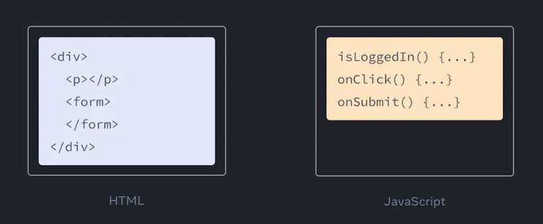
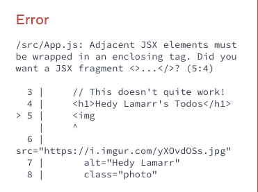
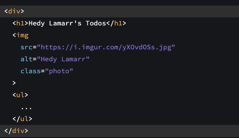
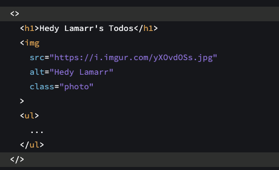
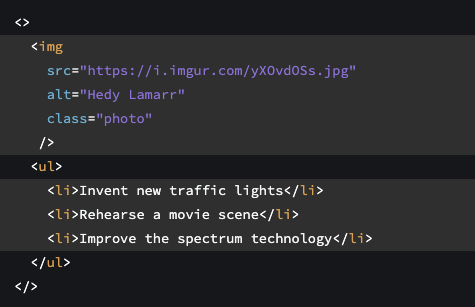
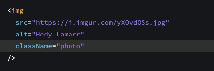
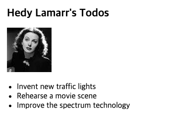

# Writing Markup with JSX

JSX는 자바스크립트 파일 안에서 HTML 과 유사한 마크업을 작성하게 해주는 

자바스크립트의 문법 확장이다.

컴포넌트를 작성하는 다른 방법도 있지만, 

대부분 리액트 개발자들은 JSX 의 간결함을 선호하고 대부분의 코드베이스는 JSX를 사용한다.

### 👨‍💻 얻을 수 있는 내용

- 리액트가 왜 렌더링 로직과 마크업을 혼합해서 쓰는 이유
- JSX는 HTML 과 어떻게 다른지
- JSX를 사용해서 정보를 보여주는 방법

### JSX : 자바스크립트 안에 마크업 놓기

HTML, CSS, Javascript는 웹에 구축되어져있다. 수년 동안 웹 개발자는 콘텐츠를 HTML로, 디자인을 CSS로, 로직을 JavaScript로 유지했으며 종종 별도의 파일로 보관했습니다.

콘텐츠는 HTML 안에 마크업 되어있으며, 

페이지의 로직은 자바스크립트 안에 별도로 존재한다.



하지만 웹이 더욱 상호작용적으로 변하면서 Logic이 점점 더 콘텐츠를 결정하게 되었습니다.

Javascript가 HTML을 담당하게 됐습니다!

이것이 React에서 렌더링 로직과 마크업이 같은 장소, 즉 구성 요소에 함께 존재하는 이유입니다.


버튼의 렌더링 로직과 마크업을 함께 유지하면 편집할 때마다 서로 동기화가 유지됩니다.

반대로, 버튼의 마크업과 사이드바의 마크업과 같이 관련이 없는 세부 사항은 

서로 격리되어 있으므로 둘 중 하나를 직접 변경하는 것이 더 안전합니다.

각각의 리액트 컴포넌트는 자바스크립트 함수이고, 

그 자바스크립트 함수는 일부 마크업들을 포함하면서 리액트는 브라우저에 렌더링된다.

리액트 컴포넌트들은 마크업을 표시해주는 JSX 라는 문법 확장을 사용한다.

JSX는 HTML과 유사하게 보이지만, 꽤 엄격하고 동적인 정보를 표시해준다.

가장 쉽게 이해할 수 있는 방법으로는 HTML 마크업을 JSX 마크업으로 전환하는 것이다.  
<br>

### 🗒️ Note  

**JSX 와 React는 별개의 것 입니다.** 

이 두개는 종종 같이 사용되지만, 

각각 서로 분리해서 사용할 수 있습니다.

JSX는 문법확장 인 반면에, React는 자바스크립트 라이브러리 이다.

<br>

## HTML 에서 JSX로 변환

(완벽하게 유효한)  HTML이 있다고 가정해 보겠습니다.

```jsx
<h1>Hedy Lamarr's Todos</h1>

<ul>
    <li>Invent new traffic lights
    <li>Rehearse a movie scene
    <li>Improve the spectrum technology
</ul>
```

그리고 컴포넌트에 넣기를 원한다면.

```jsx
export default function TodoList() {
  return (
    // ???
  )
}
```

그대로 복사해서 붙여넣으면 작동하지 않습니다.

```jsx
export default function TodoList() {
  return (
    // This doesn't quite work!
    <h1>Hedy Lamarr's Todos</h1>
    
    <ul>
      <li>Invent new traffic lights
      <li>Rehearse a movie scene
      <li>Improve the spectrum technology
    </ul>
  );
}
```



이유는 JSX가 HTML보다 더 엄격하고 몇 가지 더 많은 규칙을 가지고 있기 때문입니다! 
위의 오류 메시지를 읽으면 마크업 수정 방법이 안내되거나 아래 가이드를 따를 수 있습니다.

### Note

대부분의 경우 React의 화면 오류 메시지는 문제가 있는 위치를 찾는 데 도움이 됩니다. 
막히면 읽어보세요!  
<br>


## JSX의 규칙

### 1. 단일 루트 요소를 반환해라

컴포넌트로부터 다수의 요소를 리턴하려면 단일 부모 태그로 요소들을 감싸라.  
<br>

예를 들어서, `<div>` 태그를 사용할 수 있다. :



마크업에 `<div>` 태그를 사용하고 싶지 않다면, 대신에 <> 와 </> 사용할 수 있다.

 



이 빈 태그를 Fragment 라고 부른다. 

Fragment는 브라우저 HTML 트리에 흔적을 남기지 않고 요소들을 그룹화 시켜준다.

🧐 **Deep Dive**

### 여러 JSX 태그들을 감싸야하는 이유가 뭘까?

JSX는 HTML과 같아 보이지만 내부적으로는 일반 JavaScript 객체로 변환된다.

두 객체를 배열로 감싸지 않고는 함수에서 두 객체를 반환할 수 없다.

이는 두 개의 JSX 태그를 다른 태그나 Fragment로 래핑하지 않고는

 반환할 수 없는 이유를 설명해준다.  
 <br>


## 2. 모든 태그들을 닫아라.

JSX는 태그들이 명시적으로 닫아줘야한다.

`` 와 같은 self-closing 태그는 `` 처럼 돼야만 하고

`<li>` 와 같이 감싸는 태그들은 `<li>oranges</li>` 처럼 작성돼야한다. 

Hedy Lamarr의 이미지와 목록 항목이 닫힌 모습은 다음과 같다.



## 3. 카멜케이스

JSX는 JavaScript로 바뀌고 JSX로 작성된 속성은 JavaScript 객체의 키가 된다.

자신의 컴포넌트에서 이러한 속성을 변수로 읽어들이고 싶은 경우가 많다. 

그러나 JavaScript에는 변수 이름에 제한이 있다.

예를 들어 이름에는 대시를 포함할 수 없거나 클래스와 같은 예약어를 사용할 수 없습니다.

이것이 React에서 많은 HTML 및 SVG 속성이 camelCase로 작성된 이유이다.

예를 들어서

stroke-width 대신 strokeWidth를 사용한다.

class는 예약어이므로 React에서는 해당 DOM 속성의 이름을 따서 className으로 작성한다.



DOM 구성 요소 props 목록에서 이러한 모든 속성을 찾을 수 있다.

하나라도 틀려도 걱정하지 마라.

React는 가능한 수정 사항이 포함된 메시지를 브라우저 콘솔에서 출력해준다.

### ⚡ 함정

전통적 `aria-*` 및 `data-*` 속성은 대시를 사용하여 HTML로 작성된다.

## 전문가 팁 : JSX 변환기 사용

기존 마크업에서 이러한 모든 속성들을 변환하는 것은 지루할 수 도 있다.

기존의 HTML 과 SVG 를 JSX  로 변환하려면 변환기를 사용하는게 좋다.

컨버터들은 매우 실용적이지만 JSX를 스스로 편안하게 작성할 수 있도록

무슨 일이 일어나고있는지 이해하는 것은 여전히 가치가 있다.

여기에 마지막 결과가 있다.

```jsx
export default function TodoList() {
  return (
    <>
      <h1>Hedy Lamarr's Todos</h1>
      
      <ul>
        <li>Invent new traffic lights</li>
        <li>Rehearse a movie scene</li>
        <li>Improve the spectrum technology</li>
      </ul>
    </>
  );
}
```



## 📚 요약

이제 당신은 왜 JSX 가 존재하고 컴포넌트 내에서 사용하는 방법을 안다.

- React 컴포넌트들은 서로 연관되어 있기 때문에 렌더링 로직을 마크업과 함께 그룹화한다.
- JSX는 HTML 과 유사하지만 몇가지 차이점이 있다. 필요한 경우에 컨버터를 사용할 수 있다.
- 에러메시지들은 마크업 수정에 대해 올바른 방향을 알려주는 경우가 많다.